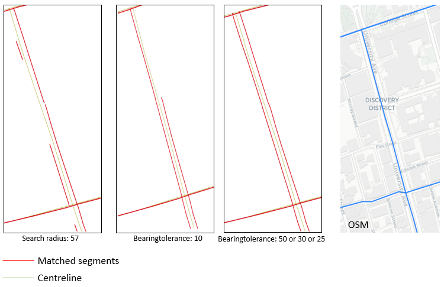
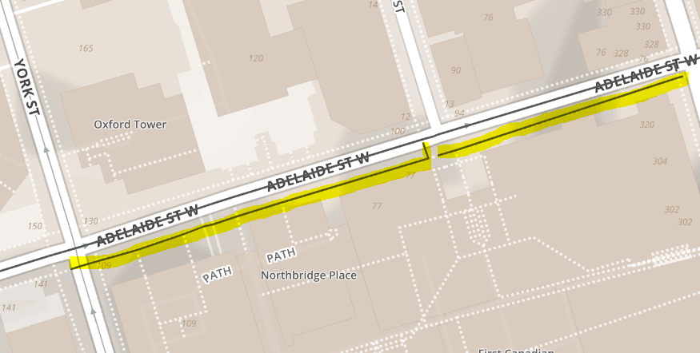
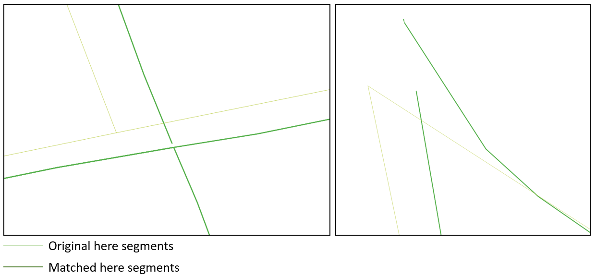
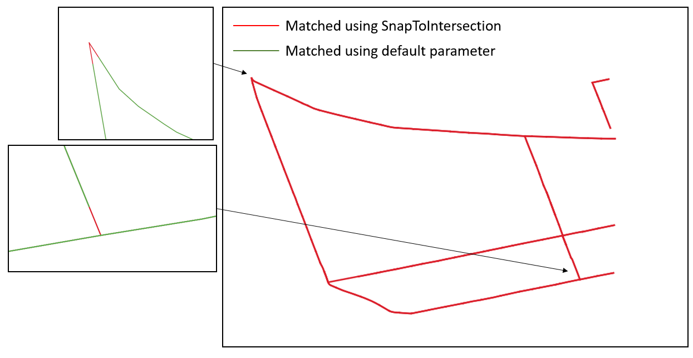
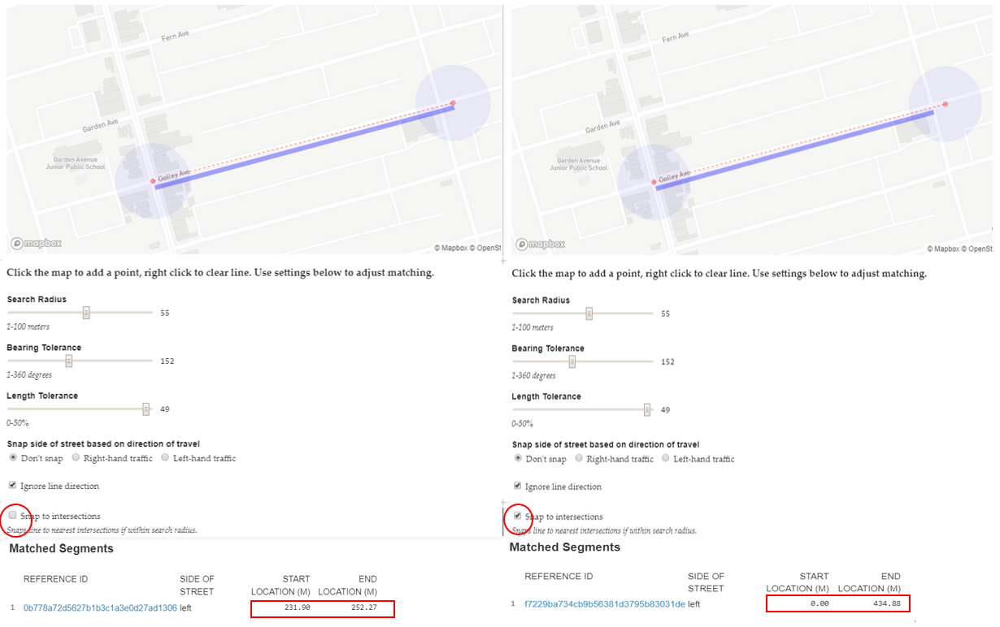

# bdit_shared_streets_conflator
Convert geographic layers in Postgresql to SharedStreets references

## Table of Contents

1. [What is SharedStreets?](#what-is-sharedstreets)

2. [How to conflate data with SharedStreets?](#how-to-conflate-data-with-sharedstreets)
    
   - [Parameter tuning](#parameter-tuning)
    
   - [Data format returned from the API](#data-format-returned-from-the-api)
    
   - [How to conflate data](#how-to-conflate-data)
   
3.  [General Challenges](#general-challenges)

     - [Problems with medians](#problems-with-medians)
   
     - [Matching up sidewalks](#matching-up-sidewalks)
   
     - [Gaps in intersections](#gaps-in-intersections)
   
     - [Problems with SnapToIntersection](#problems-with-snaptointersection)
     
     - [Intersection offset](#intersection-offset)

4.  [More on quirks with particular datasets](#more-on-quirks-with-particular-datasets)

     - [HERE](#here)
     
     - [Centreline](#centreline)
    
     - [Bluetooth](#bluetooth)
     
        - [Highway](#problems-with-matching-highways)
    
## What is SharedStreets
SharedStreets is a linear referencing systems that allows the identification of different street segments to be linked to the same street.
See [SharedStreets' website](https://sharedstreets.io/) for more detail. 


<sup>Source: SharedStreets Github
## How to conflate data with SharedStreets

### Parameter tuning 

| Parameter | Description | Options |
|-------------------------|---------------------------------------------------------------------------------------------|---------------|
| Bearing   Tolerance | Degrees tolerance   to allow for directional street queries | 0-360 degrees |
| Search   Radius | Search radius in   meters for snapping streets to SharedStreets references | 1-100 meters |
| Length   Tolerance | Line length for   potential matches specified as a percent of total line length | 0-100% |
| Ignore   line direction | Option to include   directional information | TRUE / FALSE |
| Snap   to Intersection | Snap to complete   street segments at nearby intersections that is within the search radius | TRUE / FALSE |
| Tile   Hierarchy* | Define which subclasses of road class will be use for matching | 6 |
| Planet* | The version of OSM data SharedStreets API will use for matching | 180430 |

*Changing `tileHierarchy` and `planet` will result in a different set of reference_id

Use [Getting started with SharedStreets](https://beta.observablehq.com/@kpwebb/sharedstreets-api) to explore how parameter tuning affects matching results.

### Data format returned from the API

**Field Name**|**Description**|**Example**
:-----:|:-----:|:-----:
referenceId|Unique segment identifier representing a route between two point locations|87ff3e1043661e411cd2de14d92b9aa2
fromIntersectionId|Interesection Id for the start point of each sharedstreets reference |66dc481c2f25c91f61a40d3cf5f536bc
toIntersectionId|Interesection Id for the end point of each sharedstreets reference|108588a1eb9725fcdd1d9deb8e361238
roadClass|Road class reference derived from Open Street Map|Secondary
direction|Direction of Sharedstreets reference street segments|forward
geometryId|ID for geometry of SharedStreets reference street regardless of length snapped|9a2dc5c132b317150646509c1368f2a4
referenceLength|The total length of the sharedstreets referencing street matched|137.71
sections|The section of the sharedstreets referencing street that matched to the uploaded street geometry|[90, 137.71]
side|Side of street|left
score|General matching score|1.264
originalFeature|Original attributes of the uploaded file|analysis_id
geometry|The geometry type and the coordinates of the start and end point of a line string|Linestring, [-79.4455095, 43.7546433], [-79.459156, 43.754648]

### How to conflate data

1) Create an output table in PostgreSQL using `gis_shared_streets.output_table_structure`

2) Create a query info table in PostgreSQL using `gis_shared_streets.query_info_table`

3) Make sure your data:
    - Only include streets (filtered before conflating)
    - Have a primary key of one or two columns
    - If a street is bi-directional then there should be one geometry for each direction
    
4) Run this function in conflator.ipynb:
```ruby
matching(search_radius, length_tolerance, bearing_tolerance, previously_unmatched_id, input_table, output_table, query_info_table, primary_key1, primary_key2, con)
```
| Variables               | Description                                                                                                                                                          | Example                                          |
|-------------------------|----------------------------------------------------------------------------------------------------------------------------------------------------------------------|--------------------------------------------------|
| search_radius           | Search radius in meters for snapping streets to SharedStreets references                                                                                             | 35                                               |
| length_tolerance        | Line length for potential matches specified as a percent of total line   length                                                                                      | 0.5                                              |
| bearing_tolerance       | Degrees tolerance to allow for directional street queries                                                                                                            | 35                                               |
| previously_unmatched_id | list of IDs that were unmatched with previous calls to this function. If this is the first time calling the function on a dataset, then the value   should be None | None                                             |
| input_table             | name of table with geometry that you would like to match to shared   streets                                                                                         | `gis.centreline_one_way`                         |
| output_table            | name of table that the matched rows will be inserted into                                                                                                            | `gis_shared_streets.centreline_both_way_test`    |
| query_info_table        | name of the table that records the general information each time we run   the function                                                                               | `gis_shared_streets.centreline_query_info_table` |
| primary_key1            | the primary key of the input table                                                                                                                                   | `geo_id`                                         |
| primary_key2            | the second primary key of the input table (e.g. if primary_key1 is not   the unique identifier for the table)                                                        | `direction`                                      |
| con                     | database connection credentials                                                                                                                                      |                    -                              |


## General Challenges

#### Problems with medians 
Streets that are drawn differently in Open Street Map, such as streets with medians, are not being matched in SharedStreets API. For streets with medians, it can be returned as "matched" when only half of the direction of the street are actually matched. 

York Street between Front Street West and Bremner Boulevard is represented in one line in centreline but two lines in open street map.


In effort to match both of the lines in SharedStreets, `bearingTolerance` of 10, 25, 30, and 50 was used, but they all came back with the same result as the picture above.

Some successful examples:

On this example section of University Avenue, after tuning the `bearingTolerance` parameter, both of the lines got matched up.



**Lowering the `bearingTolerance`appears to match up a lot of missing segments (e.g. `bearingTolerance=50` instead of `bearingTolerance=90`)**

#### Matching up sidewalks

Some sidewalks and residential streets are being matched up in SharedStreets. 
On this example section of Adelaide Street from York to Yonge (one way), the sidewalk was also getting matched adjacent to the actual street, with an attribute of `roadType`: Other, and `score` >5 



**Use `tileHierarchy=6` instead of `tileHierarchy=8` eliminates sidewalks and some residential streets being matched.**
(*Point to note: using different `tileHierarchy` will result in different referenceId for the same street*)

#### Gaps in intersections

Gaps appeared at some intersections such as the example below from a section of HERE data.



**Use `snapToIntersections=TRUE` and tune the `searchradius`, SharedStreets will now snap the matched street to the closest intersection, resulting in segments without gaps!**



(*Point to note: `snapToIntersections=TRUE` will resulted in messy `section` attribute. For more details, check [Problem with snaptoIntersection](#problem-with-snaptointersection)*)

#### Problems with SnaptoIntersection  

Using `snapToIntersection` might eliminate gaps in intersections, but it also messes up the `section` attribute. The `section` attribute is crucial in validating how well SharedStreets API matched with our dataset by comparing the length of the matched segments with the length of our original data. The following example generated from [Getting started with SharedStreets](https://beta.observablehq.com/@kpwebb/sharedstreets-api) shows the difference of returned attributes of two different `snapToIntersection` setting from the matched segments. When `snaptoIntersection` is set as `TRUE`, the start location changed to 0 and the end location changed to the total length of the SharedStreets reference street length. This also resulted in multiple different segments matched as one sharedstreet segment as they now all have the same `section` attribute. 



#### Intersection Offset

Due to the difference of geometry between OSM and some spatial datasets (e.g. HERE links), some segments might be matched incorrectly. On this example of a SharedStreets returned HERE segment on College between Bathurst and Dovercourt, Bathurst on Open Street Map is located to the right of where HERE links' Bathurst street was drawn. This resulted in an extra HERE link being matched to the Dovercourt to Bathurst Bluetooth segment instead of the Bathurst to University segment.


## More on quirks with particular datasets

### HERE

(to be filled in)


### Centreline

Some of the issues we have encountered while wokring with centreline are [problems with medians](#problems-with-medians), [intersection offset](#intersection-offset)[(#12)](issues/12) as well as some matched value returned without attributes [(#11)](issues/11). 
Since streets in the centreline layer do not contain directional information, we extracted `gis.centreline_one_way` from the Open Data Catalogue to create a layer (`gis_shared_streets.centreline_both_dir`) where there are one line for each direction using the following query:
```sql
create table gis_shared_streets.centreline_both_dir as (with temp as (select geo_id, fcode_desc, case when one_way_di = '-1' then ST_reverse(geom) else geom end as dir_geom
from gis.centreline_one_way
where one_way_di = '-1' or one_way_di = '1'

union all

select geo_id,fcode_desc,  case when one_way_di = '0' then ST_reverse(geom) end as dir_geom
from gis.centreline_one_way
where one_way_di = '0'

union all

select geo_id, fcode_desc, geom as dir_geom
from gis.centreline_one_way
where one_way_di = '0')

, tempa2 as (select geo_id, fcode_desc, gis.direction_from_line(dir_geom)as direction, dir_geom
from temp
order by geo_id)

select geo_id, fcode_desc, 'direction' || (row_number() over (partition by geo_id order by geo_id))::text as direction , dir_geom
from tempa2
where direction is null

union all

select geo_id, fcode_desc, direction, dir_geom
from tempa2
where direction is not null)
```
Unmatched rate decreased from 3.2% to 1.3% when `gis_shared_streets.centreline_both_dir` was used instead of `gis.centreline`. 


### Bluetooth

Initial failure of uploading Bluetooth segments to SharedStreets with a returning error of `505 time out`. After several trials of parameter tuning, this following parameter was able to send Bluetooth segments to SharedStreets with an acceptable match rate.

##### Suggested Parameter:

`lengthTolerance`= 0.5

`planet`= 181029

`ignoreDirection`= false

`bearingTolerance` = 50

`searchRadius` = 50


#### Problems with Matching Bluetooth Highways

However, some parts of Bluetooth highway segments have a really low matching rate, due to the distinctive difference of how OSM draws highway and how centreline is drawn. This problem is more apparent where Lakeshore and Gardiner overlap each other. The difference in geometry is too big for SharedStreets to match them correctly. Thus, it is not recommended to match Bluetooth highway segments to SharedStreets. (or any spatial datasets that differs too much from OSM)

Example 1:


Example 2:


