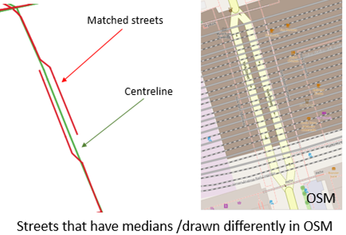

# bdit_shared_streets_conflator
Convert geographic layers in Postgresql to SharedStreets references

## Table of Contents

1. [What is SharedStreets](#what-is-sharedstreets)

2. [How to conflate data with SharedStreets](#how-to-conflate-data-with-sharedstreets)
    
   - [Parameter tuning](#parameter-tuning)
    
   - [Data format returned from the API](#data-format-returned-from-the-api)
    
   - [How to get data into the database](#how-to-get-data-into-the-database)
   
3.  [General Challenges](#general-challenges)

     - [Problems with medians](#problems-with-medians)
   
     - [Matching up sidewalks](#matching-up-sidewalks)
   
     - [Gaps in intersections](#gaps-in-intersections)
   
     - [Problems with SnapToIntersection](#problems-with-snaptointersection)

4.  [More on quirks with particular datasets](#more-on-quirks-with-particular-datasets)

     - [HERE](#here)
     
     - [Centreline](#centreline)
    
     - [Bluetooth](#bluetooth)
    
## What is SharedStreets
SharedStreets is a linear referencing systems that allows the identification of different street segments to be linked to the same street.
See [SharedStreets' website](https://sharedstreets.io/) for more detail. 


<sup>Source: SharedStreets Github
## How to conflate data with SharedStreets

For more details on how to conflate data with SharedStreets on Observable, see this [How to conflate data with Sharedstreets](https://beta.observablehq.com/@chmnata/how-to-conflate-data-with-sharedstreets) notebook.

### Parameter tuning 

**Parameter**|**Description**|**Options**
:-----:|:-----:|:-----:
Bearing Tolerance|Degrees tolerance to allow for directional street queries| 0-360 degrees
Search Radius|Search radius in meters for snapping streets to SharedStreets references| 1-100 meters
Length Tolerance|Line length for potential matches specified as a percent of total line length|0-100%
Ignore line direction|Option to include directional information| `TRUE` / `FALSE`
Snap to Intersection|Snap to complete street segments at nearby intersections that is within the search radius| `TRUE` / `FALSE`

Use [Getting started with SharedStreets](https://beta.observablehq.com/@kpwebb/sharedstreets-api) to explore how parameter tuning affects matching results.

### Data format returned from the API

**Field Name**|**Description**|**Example**
:-----:|:-----:|:-----:
referenceId|Unique segment identifier representing a route between two point locations|87ff3e1043661e411cd2de14d92b9aa2
fromIntersectionId|Interesection Id for the start point of each sharedstreets reference |66dc481c2f25c91f61a40d3cf5f536bc
toIntersectionId|Interesection Id for the end point of each sharedstreets reference|108588a1eb9725fcdd1d9deb8e361238
roadClass|Road class reference derived from Open Street Map|Secondary
direction|Direction of Sharedstreets reference street segments|forward
geometryId|ID for geometry of SharedStreets reference street regardless of length snapped|9a2dc5c132b317150646509c1368f2a4
referenceLength|The total length of the sharedstreets referencing street matched|137.71
sections|The section of the sharedstreets referencing street that matched to the uploaded street geometry|[90, 137.71]
side|Side of street|left
score|(to be filled in)|1.264
originalFeature|Original attributes of the uploaded file|analysis_id
geometry|The geometry type and the coordinates of the start and end point of a line string|Linestring, [-79.4455095, 43.7546433], [-79.459156, 43.754648]

### How to get data into the database

1) Create a table in PostgreSQL with a column with JSON as data type
2) Prepare JSON for importing
    - Delete all space in between codes
3) Import JSON to table using the following parameters:
    - Format: text
    - Delimiter: [tab]
4) Query to extract and seperate columns from JSON
```sql
with inner_json as(
select json_array_elements("referenceId"#>'{results}'->0->'features')->'properties' as properties
from schema.table
)            
SELECT x.* , (properties #>>'{originalFeature,properties,unique_og_id}')::int unique_og_id
        FROM inner_json
        cross join lateral json_to_record(properties) 
        as x( "referenceId" text,
                "fromIntersectionId" text,
                "toIntersectionId" text,
                "roadClass" text,
                "direction" text,
                "geometryId" text,
                "referenceLength" numeric,
                "section" json,
                side text,
                score numeric)
```
## General Challenges

#### Problems with medians 
Streets that are drawn differently in Open Street Map, such as streets with medians, are not being matched in SharedStreets API.

York Street between Front Street West and Bremner Boulevard is represented in one line in centreline but two lines in open street map.



In effort to match both of the lines in SharedStreets, `bearingTolerance` of 10, 25, 30, and 50 was used, but they all came back with the same result as the picture above.

Some successful examples:

On this example section of University Avenue, after tuning the `bearingTolerance` parameter, both of the lines got matched up.


**Lowering the `bearingTolerance`appears to match up a lot of missing segments (e.g. `bearingTolerance=50` instead of `bearingTolerance=90`)**

#### Matching up sidewalks

Some sidewalks and residential streets are being matched up in SharedStreets. 
On this example section of Adelaide Street from York to Yonge (one way), the sidewalk was also getting matched adjacent to the actual street, with an attribute of `roadType`: Other, and `score` >5 


**Use `tileHierarchy=6` instead of `tileHierarchy=8` eliminates sidewalks and some residential streets being matched.**
(*Point to note: using different `tileHierarchy` will result in different referenceId for the same street*)

#### Gaps in intersections

Gaps appeared at some intersections such as the example below from a section of HERE data.


**Use `snapToIntersections=TRUE` and tune the `searchradius`, SharedStreets will now snap the matched street to the closest intersection, resulting in segments without gaps!**


(*Point to note: `snapToIntersections=TRUE` will resulted in messy `section` attribute. For more details, check [Problem with snaptoIntersection](#problem-with-snaptointersection)*)

#### Problems with SnaptoIntersection  

Using `snapToIntersection` might eliminate gaps in intersections, but it also messes up the `section` attribute. The `section` attribute is crucial in validating how well SharedStreets API matched with our dataset by comparing the length of the matched segments with the length of our original data. The following example generated from [Getting started with SharedStreets](https://beta.observablehq.com/@kpwebb/sharedstreets-api) shows the difference of returned attributes of two different `snapToIntersection` setting from the matched segments. When `snaptoIntersection` is set as `TRUE`, the start location changed to 0 and the end location changed to the total length of the SharedStreets reference street length. This also resulted in multiple different segments matched as one sharedstreet segment as they now all have the same `section` attribute. 


## More on quirks with particular datasets

### HERE

(to be filled in)


### Centreline

(to be filled in)


### Bluetooth

Failed to upload Bluetooth segments, sections of Bluetooth segments, and non-overlapping Bluetooth segments to SharedStreet API. The returning error is `505 time out`. Since Bluetooth is drawn by centreline, centreline was used instead of Bluetooth segments. A reference table of bluetooth and corresponding centreline was then created for linking matched sharedstreets id back to blueooth segments.

